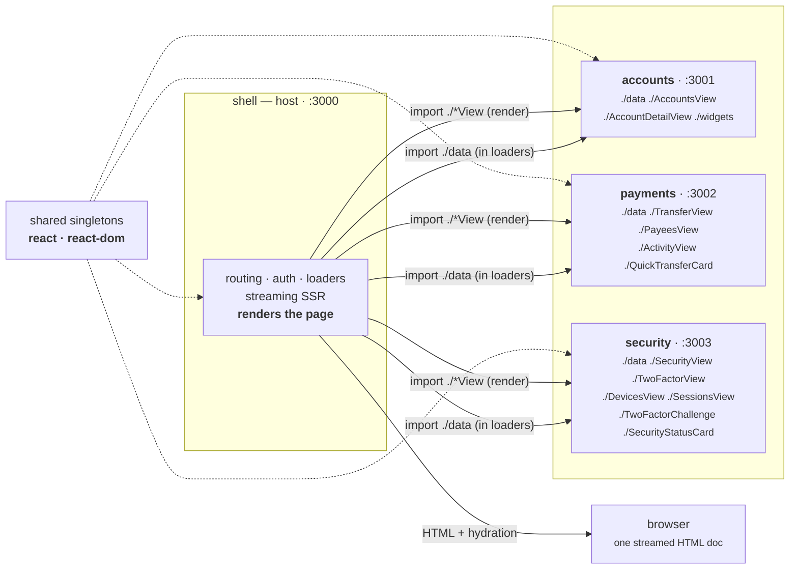
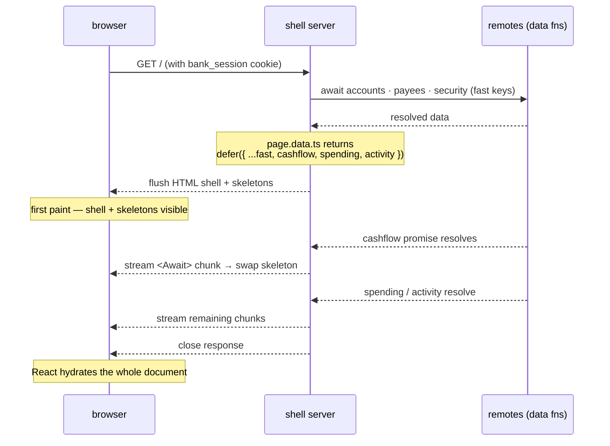
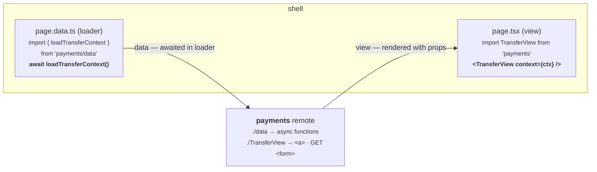
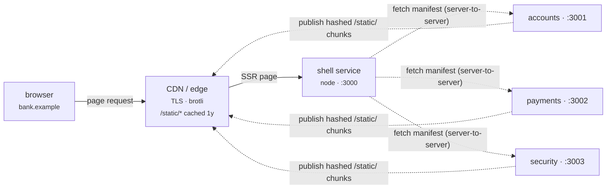

# Northwind Architecture

> A working retail-banking front end split into **four independently deployed apps**,
> composed at request time with **Module Federation 2.0** and server-rendered as one
> streamed HTML response.
>
> Stack: **Modern.js 3.5** (Rspack) · **@module-federation/modern-js-v3 2.8.2** ·
> **React 18.3** streaming SSR · **React Router 7** file routes · **shadcn/ui** + Tailwind v4.
> *Not Next.js.*

There is also a designed, single-file version of this document at
[`docs/architecture.html`](architecture.html) — open it in a browser for the same content
with styled diagrams.

- [01 · What this is](#01--what-this-is)
- [02 · Architecture](#02--architecture)
- [03 · How a request renders](#03--how-a-request-renders)
- [04 · The federation contract](#04--the-federation-contract)
- [05 · Routing & auth](#05--routing--auth)
- [06 · Performance](#06--performance)
- [07 · Run it locally](#07--run-it-locally)
- [08 · Deploy](#08--deploy)

---

## 01 · What this is

Northwind is a retail-banking dashboard — accounts, transfers, payees, cards, two-factor
security — built as a **micro-frontend**. One host app (the *shell*) owns routing, the page
chrome, auth, and data loading. Three *remote* apps each own one banking domain and expose
their screens and their data functions as federated modules. The shell pulls those in at
runtime and renders everything into a single server-streamed response.

Each of the four apps is a **standalone repository** — its own `package.json` with real
version numbers, its own `node_modules`, its own git history, its own build and deploy.
There is no monorepo and no workspace. `shell/` could live on a different machine in a
different org and nothing would change except a URL. Shared UI is shadcn components
*copied* into each app as source — it is not shipped as a federated module.

The app also demonstrates the render boundary directly. Every authenticated page carries a
badge in the header: `⚡ SSR · 14:32:01` with the Node version and pid that produced the
HTML, or `💻 CSR` on `/insights`, the one route that deliberately renders in the browser
from the same federated data module.

| | |
|---|---|
| **Apps** | `shell :3000` (host) · `accounts :3001` · `payments :3002` · `security :3003` |
| **Composition** | Module Federation 2.0 — runtime remotes, shared React singletons, SSR-aware |
| **Rendering** | `server.ssr.mode: "stream"` — the shell flushes first, then `<Suspense>` / `<Await>` content streams in behind skeletons |
| **Data** | Per-app `src/mock/` — deterministic seeded banking data, an HMAC-signed session cookie, artificial latency so streaming is visible |
| **Auth** | Any email + password → 2FA code `123456` → signed cookie |

---

## 02 · Architecture

The shell declares the three remotes by their manifest URL. At render time it imports two
kinds of thing from each remote: plain **async data functions** from `<remote>/data`, which
it calls inside its route loaders, and **router-free view components**, which it renders
with the resolved data. The remotes never touch routing or navigation — they use
`<a href>` and GET forms — so the same component renders identically whether it is running
standalone on its own port or federated into the shell's SSR stream.



*The shell imports `./data` in its loaders and the `*View` components for rendering.
`react` and `react-dom` are the only shared modules.*

### Why only `react` and `react-dom` are shared

Module Federation's `shared` map forces one instance of a package across all apps. React
*must* be a singleton — two copies means two reconcilers and broken hooks. But sharing
`react-router` or the Modern.js runtime pulls each remote's framework bootstrap into the
shell, and that bootstrap renders its own `<Router>`. The fix is the constraint above:
remotes ship presentational components only, the shell owns every router hook, loader, and
`<Suspense>` boundary.

---

## 03 · How a request renders

A page load is one HTTP response that stays open. The shell resolves the fast data, sends
the full page shell with skeletons, and then streams each slow region in as its promise
settles — all before the connection closes. The browser paints progressively; React
hydrates when the document finishes.



`page.data.ts` returns `defer({ accounts, …, cashflow, spending, activity })`: the first
keys are awaited, the last three are unresolved promises rendered inside
`<Suspense><Await>`. One response carries the shell and, moments later, the three regions.

The federated widgets participate in this stream. `accounts/widgets` exports the cashflow
and spending charts and the recent-activity list; the shell renders them server-side with
the streamed data, so "view source" on the dashboard shows real numbers — `$128,032.02`,
`Everyday Checking`, transaction rows — in the HTML, not an empty div.

---

## 04 · The federation contract

Every remote exposes the same shape: one `./data` module of plain async functions, and one
component per screen. The split is the whole trick — data crosses the boundary as a
function the shell awaits in a loader; UI crosses as a component the shell renders with
props already resolved.



The remote returns data and markup — never a hook, a route, or a `<Link>`.

| Remote | Exposes | Consumed by (shell route) |
|---|---|---|
| **accounts** `:3001` | `./data` — loadAccountsList, loadAccountDetail, loadDashboardWidgets<br>`./AccountsView` · `./AccountDetailView`<br>`./widgets` — CashflowCard, SpendingCard, RecentActivityCard | `/` (dashboard)<br>`/accounts`<br>`/accounts/:id`<br>`/insights` (client-side) |
| **payments** `:3002` | `./data` — loadTransferContext, loadPayees, loadTransfers, submitTransfer<br>`./TransferView` · `./PayeesView` · `./ActivityView`<br>`./QuickTransferCard` | `/` (quick transfer)<br>`/payments`<br>`/payments/payees`<br>`/payments/activity` |
| **security** `:3003` | `./data` — loadSecurityOverview, loadDevices, loadSessions, verifyCode, setTwoFactorEnabled<br>`./SecurityView` · `./TwoFactorView` · `./DevicesView` · `./SessionsView`<br>`./TwoFactorChallenge` · `./SecurityStatusCard` | `/` (status card)<br>`/login/verify` (2FA)<br>`/security` · `/security/two-factor`<br>`/security/devices` · `/security/sessions` |

### Version matrix — pinned in every app's `pnpm.overrides`

The Module Federation stack is fragile across minor versions. All four apps pin the
identical set:

| Package | Version |
|---|---|
| `@rspack/core` | `2.1.8` |
| `react-server-dom-rspack` | `0.0.2` |
| `@module-federation/*` | `2.8.2` |
| `@module-federation/node` | `2.7.36` |
| `react` / `react-dom` | `18.3.1` |
| `pnpm` (via `packageManager`) | `9.15.4` |

---

## 05 · Routing & auth

The shell uses Modern.js file-system routing (React Router 7 under the hood).
`src/routes/__app/` is the authenticated tree behind a layout loader that checks the
session; `src/routes/__auth/` is the login flow. A route's `page.data.ts` is its loader and
action; `page.tsx` is the view.

**The auth flow**

1. **Login** — any email + password. The action sets a short-lived `bank_2fa_pending`
   cookie and returns `{ next }` as JSON.
2. **Verify** — the shell renders `security/TwoFactorChallenge` (a federated `input-otp`
   widget). Code `123456`. The action sets the HMAC-signed `bank_session` cookie.
3. **Guarded** — `__app/layout.data.ts` verifies the cookie signature with `node:crypto`
   on every request and redirects to `/login` if it fails.

> **Modern.js 3.5 quirk, handled in code.** The client data layer follows redirect
> responses from route *loaders* but not from *actions*. The auth actions therefore return
> `{ next }` + `Set-Cookie` and the component calls `useNavigate(next)`. Only one
> `Set-Cookie` per action response survives — the verify action sets `bank_session` only.

> **`useId` under streamed SSR.** Modern.js numbers React's `useId` by streamed-boundary
> position, so a Radix trigger (Popover / Select / Tabs / DropdownMenu) that renders on the
> server hydrates with a different generated id than the client computes
> ("Prop `aria-controls` did not match"). Three rules keep every route's SSR HTML free of
> `useId`-derived ids: charts pass a stable `id` to `ChartContainer` (shadcn's own API);
> the header menus render a static trigger and mount the Radix popover/dropdown after
> hydration; and the two federated views that had a server-rendered Radix trigger use plain
> controls instead — `TransferView` a native `<select>`, `ActivityView` a `useState`
> segmented toggle. Both pages stay fully server-rendered. This is dev-only and gone in
> production builds regardless.

---

## 06 · Performance

The render path is built for a fast first paint: streaming SSR gives an early, data-filled
shell; route code is split per page; federated code loads only on the routes that use it;
and the document head is kept clear of anything render-blocking from a third party.

| Lever | What it does | Setting |
|---|---|---|
| Streaming SSR | Shell HTML flushes before slow data resolves; regions stream in behind skeletons. Fast TTFB, progressive paint. | `server.ssr.mode: "stream"` |
| Self-hosted font | One 47 KB variable Inter (Latin) woff2, same-origin, `<link rel=preload>`, `font-display: swap`. No Google Fonts stylesheet, no second origin. Mono falls back to the platform font. | `src/assets/` + `@font-face` in `styles.css` |
| Evergreen target | No polyfill chunk, no legacy transpilation — SWC emits modern syntax. | `output.polyfill: "off"` + `browserslist: chrome >= 100 …` |
| Lean prod bundle | `console.*` stripped; no client source maps shipped (~4.7 MB of `.map` not deployed). | `performance.removeConsole` + `output.sourceMap: false` |
| Scoped preload | Only the font is preloaded — not every route chunk / font subset. | `performance.preload: { type: "all-chunks", include: [/\.woff2$/] }` |
| Code splitting | One JS chunk per route; shared vendor chunks; the charts library loads only where a chart renders. | Rspack defaults |
| Immutable static assets | Hashed filenames under `/static/` — cache one year, serve from a CDN. | `Cache-Control: immutable` |
| No `user-scalable=no` | Default mobile viewport replaced so pinch-zoom works (accessibility). | `html.meta.viewport` |
| Build cache | Faster rebuilds. | `performance.buildCache` |

### Transfer budget

| Resource | Raw | Gzip | Notes |
|---|--:|--:|---|
| `index` entry | 113 KB | 32 KB | runtime + MF host |
| `lib-router` | 96 KB | 31 KB | React Router 7 + data layer |
| `__app/layout` | 40 KB | 10 KB | sidebar, header, command menu |
| dashboard `page` | 14 KB | 5 KB | route-specific |
| app CSS (all) | 67 KB | 12 KB | Tailwind v4, used classes only |
| Inter woff2 | 47 KB | — | already compressed, preloaded |

Shell, all routes combined: **1.26 MB raw / 401 KB gzip**. A single page loads a fraction —
the dashboard's own JS is ≈ 80 KB gzip before shared vendor chunks.

### Web Vitals posture

- **LCP** — the largest text block is in the first flushed chunk of HTML (SSR), and its
  font is preloaded same-origin. No render-blocking third party in `<head>`.
- **CLS** — `font-display: swap` with a close-metric system fallback; streamed regions
  occupy reserved skeleton space, so the skeleton → content swap does not reflow the page.
- **INP** — React 18 concurrent renderer; interactive-only widgets (menus, the transfer
  form) mount after hydration so they never block it.

> **Measure against a real deployment.** Numbers above are build output. Run Lighthouse or a
> field tool against a deployed instance for LCP / CLS / INP — the dev server (unminified,
> HMR) and the production federation caveat in section 08 both make a local Lighthouse run
> misleading.

---

## 07 · Run it locally

Node 18+. Run `corepack enable` once — pnpm 9.15.4 is provisioned automatically from each
app's `packageManager` field. Everything is driven from the top folder, which holds only
orchestration scripts.

```bash
# install all four apps
npm run install:all

# clears caches, boots the 3 remotes one by one, then the shell
npm run dev            # → http://localhost:3000

# any email + password, then 2FA code 123456
```

| Command | Effect |
|---|---|
| `npm run install:all` | `pnpm install` in each app |
| `npm run dev` | serial remote boot, then shell — aborts if :3000–:3003 are busy |
| `npm run stop` | kill a lost dev run whose terminal is gone |
| `npm run build` | `modern build` in each app |
| `npm run start` | `modern serve` in each app (production) |
| `npm run typecheck` | `tsc --noEmit` in each app |
| `npm run init:git` | turn each app into its own git repository |

Each app also runs alone — `cd accounts && npm run dev` serves the accounts remote on :3001
with its own routes, useful for building a domain in isolation.

---

## 08 · Deploy

Four deployables, four pipelines. Each app is `install → build → serve` — a long-lived Node
process (`modern serve`) behind a CDN. They find each other purely through environment
variables: the shell needs each remote's public origin to build the manifest URLs; each
remote needs its own public origin so its hashed chunks load from the right place.



*Solid = browser request path · dashed = server-to-server. The browser only ever talks to
the shell (through the CDN). The shell's server resolves the three remote manifests
server-to-server at render time.*

### Environment

| Variable | Set on | Value |
|---|---|---|
| `PORT` | all | listen port (defaults 3000–3003) |
| `SHELL_ORIGIN` | shell | public base URL for the shell's own assets (or a CDN) |
| `ACCOUNTS_ORIGIN` | shell + accounts | public URL of the accounts service — manifest on the shell, `assetPrefix` on the remote |
| `PAYMENTS_ORIGIN` | shell + payments | … same for payments |
| `SECURITY_ORIGIN` | shell + security | … same for security |
| `SESSION_SECRET` | all | HMAC key for the session cookie — must match across apps |

### Container (recommended)

One image per app: `node:20-alpine`, `corepack enable`, `pnpm install --frozen-lockfile`,
`pnpm build`, `CMD pnpm serve`. Deploy to Cloud Run, Fly.io, Render, Railway,
AWS App Runner / ECS, or Azure Container Apps. Put Cloudflare or the platform CDN in front
for TLS, compression, and `/static/` caching.

### Serverless / platform

Modern.js ships deploy adapters — `output.deploy` targets Vercel, Netlify, or a plain Node
bundle. Deploy each app as its own project with its own domain, wire the `*_ORIGIN` vars to
those domains.

### CI

A change in `accounts/` rebuilds and redeploys only that service. The contract that keeps
them compatible is the exposed module names and the shared React version — both change
rarely and both are reviewed. A shell deploy is only needed when a route, a loader, or the
page chrome changes.

> **Known limitation — production SSR federation.** `modern serve` does not serve the SSR
> remote-entry at `/bundles/static/remoteEntry.js`, so on a plain production deploy the
> federated widgets fall back to **client rendering** — they still work, they just aren't
> in the streamed HTML for those regions. Full SSR federation works in `npm run dev`.
>
> Fix path: a small static middleware serving each remote's `dist/bundles/static/`, or the
> `staticServePlugin` from `@module-federation/modern-js-v3` once its build-time init issue
> is resolved for this Modern.js version.

---

*Engineering reference — regenerate when the federation contract or deploy topology changes.*
