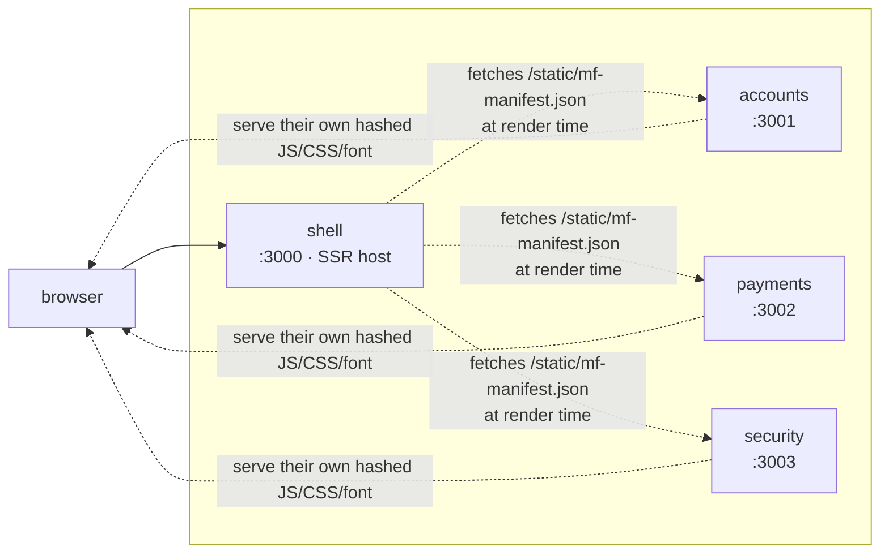

# Deployment

A step-by-step runbook for putting the four apps online. Pairs with
[`ARCHITECTURE.md` §08](ARCHITECTURE.md#08--deploy), which covers the topology; this file is
the procedure.

---

## 1. One repo or four?

**You can deploy all four from a single repo. Module Federation does not care how your
source is organised** — it only cares that at runtime each app is a separate running
service reachable at its own URL. "Separate them" is a team-workflow choice, not a
technical requirement.

| | One repo (monorepo) | Four repos (polyrepo) |
|---|---|---|
| Deploy | Point each service at a subfolder (`rootDir: shell`, etc.). One `git push` can redeploy any/all. | Each app has its own repo + its own pipeline. |
| Best when | One person or one team owns everything. **← you** | Separate teams own each domain and release on their own cadence. |
| CI | Path filters (`accounts/**` → build accounts). | Natural — a push to the repo *is* the trigger. |
| Overhead | One `.gitignore`, one PR flow. | Four of everything; version drift between apps to police. |

For this project: **one repo.** The rest of this guide assumes that.

### 1a. Fix the repo layout first (required)

Right now the root repo tracks `shell/ accounts/ payments/ security/` as **git submodule
pointers with no `.gitmodules`** — embedded repos. If you push as-is, GitHub shows four
greyed-out folders and a clone gets **empty directories**. No build platform can deploy
that.

Convert to a plain monorepo — run from the repo root:

```bash
# 1. drop the nested git repos (keeps all the files)
for a in shell accounts payments security; do rm -rf "$a/.git"; done

# 2. remove the submodule pointers from the index
git rm --cached shell accounts payments security

# 3. re-add the folders as normal tracked files
git add shell accounts payments security
git status          # now shows hundreds of new files, incl. each app's pnpm-lock.yaml

# 4. commit
git commit -m "chore: consolidate the four apps into this repo (monorepo layout)"
git push origin main
```

The root `.gitignore` already excludes `node_modules`, `dist`, `.modern-js`, `*.log` at any
depth, so the subfolders are covered. **Commit each app's `pnpm-lock.yaml`** — the builds
use `--frozen-lockfile`.

> Prefer four repos instead? Create four empty GitHub repos, then in each app:
> `git remote set-url origin <that repo>` and `git push`. The root repo then keeps only
> `scripts/`, `docs/`, `README.md`. Skip to [§4](#4-pick-a-host) — everything else is the
> same, just per-repo.

---

## 2. What you are deploying

Four long-lived Node processes. Each one is `install → build → serve` (`modern serve`,
which is an HTTP server, not a static export).



The browser loads a page from **shell** only. The shell's server fetches each remote's
manifest to know which chunks to embed; the browser then pulls those chunks **directly from
each remote's origin** — which is why every remote must be publicly reachable and must know
its own public URL (`assetPrefix`).

### Environment variables

| Variable | shell | accounts | payments | security | Value |
|---|:--:|:--:|:--:|:--:|---|
| `PORT` | ✓ | ✓ | ✓ | ✓ | Injected by the host. `modern serve` binds it. |
| `SHELL_ORIGIN` | ✓ | | | | Public URL of the shell, e.g. `https://northwind.example`. |
| `ACCOUNTS_ORIGIN` | ✓ | ✓ | | | Public URL of the accounts service. Shell uses it to build the manifest URL; accounts uses it as its own `assetPrefix`. |
| `PAYMENTS_ORIGIN` | ✓ | | ✓ | | …same, payments. |
| `SECURITY_ORIGIN` | ✓ | | | ✓ | …same, security. |
| `SESSION_SECRET` | ✓ | ✓ | | ✓ | HMAC key for the session cookie. **Must be identical** on shell, accounts, security. Generate 32+ random bytes. |

Every `*_ORIGIN` must be a full origin with scheme and **no trailing slash**:
`https://northwind-accounts.onrender.com`. Without it a remote falls back to
`http://localhost:<port>` and its assets 404 in production.

---

## 3. Dry run locally in production mode

Do this before touching a cloud platform — it catches 90% of deploy failures on your own
machine.

```bash
# from the repo root
npm run build          # modern build in all four apps → dist/ each

# serve all four the way production will, with the wiring set explicitly
SESSION_SECRET=$(openssl rand -hex 32) \
SHELL_ORIGIN=http://localhost:3000 \
ACCOUNTS_ORIGIN=http://localhost:3001 \
PAYMENTS_ORIGIN=http://localhost:3002 \
SECURITY_ORIGIN=http://localhost:3003 \
npm run start          # modern serve in all four
```

Open `http://localhost:3000`, sign in (any email + password, 2FA `123456`), and click
through every menu. Then verify SSR:

```bash
# should print real account names / numbers in the HTML, not an empty <div>
curl -s http://localhost:3000/ -H "cookie: $(curl -s -i -X POST http://localhost:3000/login/verify ... )" | grep -o "Everyday Checking"
```

(Easier: open DevTools → Network → the document response → confirm the markup contains
`$128,032.02` etc.)

> **Known caveat, expected here too:** in `modern serve` the *federated* regions
> (dashboard widgets, transfer form) render **client-side**, not in the streamed HTML —
> `modern serve` doesn't serve the SSR remote entry. The pages work; the federated blocks
> just aren't server-rendered. Full SSR federation only runs under `npm run dev`. See
> [§7](#7-the-production-ssr-federation-caveat). If the *non-federated* shell content
> (sidebar, header, `/cards`) is server-rendered and auth works, the build is good.

Windows PowerShell equivalent for the env vars:

```powershell
$env:SESSION_SECRET="<32-byte hex>"; $env:SHELL_ORIGIN="http://localhost:3000"
$env:ACCOUNTS_ORIGIN="http://localhost:3001"; $env:PAYMENTS_ORIGIN="http://localhost:3002"
$env:SECURITY_ORIGIN="http://localhost:3003"; npm run start
```

---

## 4. Pick a host

The app is **four always-on Node servers**. Anything that runs a persistent Node process
works. It is **not** a static site and **not** a good fit for pure edge/serverless without
adapter work.

| Host | Why | Notes |
|---|---|---|
| **Render** | Multiple services from one repo, `rootDir` per service, free TLS, zero Docker. **Recommended starting point.** | [§5](#5-path-a--render) |
| **Railway** | Same shape as Render, monorepo-aware. | Set "Root Directory" per service. |
| **Fly.io / Cloud Run / AWS App Runner / Azure Container Apps** | Container hosts — most portable, scale to zero (Cloud Run). | Use the Dockerfile in [§6](#6-path-b--docker-any-container-host). |
| **Vercel / Netlify** | Possible via Modern.js deploy adapters, one project per app. | The SSR-streaming + cross-origin federation story is rougher on serverless; only if you already live there. |

---

## 5. Path A — Render

### 5.1 Manual (clearest — do this first time)

Create the **remotes first**, then the shell (the shell needs their URLs).

**For each of `accounts`, `payments`, `security`:**

1. Render Dashboard → **New → Web Service** → connect the GitHub repo.
2. **Root Directory**: `accounts` (resp. `payments`, `security`).
3. **Runtime**: Node. **Build Command**:
   ```
   corepack enable && corepack pnpm install --frozen-lockfile && corepack pnpm build
   ```
4. **Start Command**: `corepack pnpm serve`
5. **Environment** →
   - `SESSION_SECRET` — same value for accounts + security (payments doesn't need it, but
     setting it everywhere is harmless). Use Render's "Generate" once, then paste the same
     value into the others.
   - Leave `<NAME>_ORIGIN` unset for now.
6. Create the service. Wait for the first deploy. Copy its URL, e.g.
   `https://northwind-accounts.onrender.com`.
7. Go back to **Environment** and add `ACCOUNTS_ORIGIN` = that URL (no trailing slash).
   Save → it redeploys. Repeat the pattern for payments/security.

**Then the shell:**

1. **New → Web Service** → same repo → **Root Directory**: `shell`.
2. Build / Start commands: identical to above.
3. **Environment**:
   - `SESSION_SECRET` — the **same** value as accounts + security.
   - `ACCOUNTS_ORIGIN` = `https://northwind-accounts.onrender.com`
   - `PAYMENTS_ORIGIN` = `https://northwind-payments.onrender.com`
   - `SECURITY_ORIGIN` = `https://northwind-security.onrender.com`
   - `SHELL_ORIGIN` = the shell's own URL (set it after the first deploy, same trick).
4. Deploy. Open the shell URL → sign in → click through.

### 5.2 Blueprint (`render.yaml`)

Commit this at the repo root to create all four in one shot. You still fill the shell's
three `*_ORIGIN` values once the remote URLs exist (Render can't know them at blueprint
time).

```yaml
envVarGroups:
  - name: northwind-shared
    envVars:
      - key: SESSION_SECRET
        generateValue: true          # one value, shared by every service below

services:
  - type: web
    name: northwind-accounts
    runtime: node
    rootDir: accounts
    plan: starter
    buildCommand: corepack enable && corepack pnpm install --frozen-lockfile && corepack pnpm build
    startCommand: corepack pnpm serve
    envVars:
      - fromGroup: northwind-shared
      - key: ACCOUNTS_ORIGIN
        sync: false                  # paste https://northwind-accounts.onrender.com after first deploy

  - type: web
    name: northwind-payments
    runtime: node
    rootDir: payments
    plan: starter
    buildCommand: corepack enable && corepack pnpm install --frozen-lockfile && corepack pnpm build
    startCommand: corepack pnpm serve
    envVars:
      - fromGroup: northwind-shared
      - key: PAYMENTS_ORIGIN
        sync: false

  - type: web
    name: northwind-security
    runtime: node
    rootDir: security
    plan: starter
    buildCommand: corepack enable && corepack pnpm install --frozen-lockfile && corepack pnpm build
    startCommand: corepack pnpm serve
    envVars:
      - fromGroup: northwind-shared
      - key: SECURITY_ORIGIN
        sync: false

  - type: web
    name: northwind-shell
    runtime: node
    rootDir: shell
    plan: starter
    buildCommand: corepack enable && corepack pnpm install --frozen-lockfile && corepack pnpm build
    startCommand: corepack pnpm serve
    envVars:
      - fromGroup: northwind-shared
      - key: SHELL_ORIGIN
        sync: false
      - key: ACCOUNTS_ORIGIN
        sync: false
      - key: PAYMENTS_ORIGIN
        sync: false
      - key: SECURITY_ORIGIN
        sync: false
```

Render Dashboard → **New → Blueprint** → pick the repo. After the first deploy, fill the
five `sync: false` values with the real URLs and let it redeploy.

---

## 6. Path B — Docker (any container host)

Add this `Dockerfile` to **each** app folder (`shell/`, `accounts/`, `payments/`,
`security/`):

```dockerfile
FROM node:20-alpine
WORKDIR /app
RUN corepack enable

# deps first — cached unless the lockfile changes
COPY package.json pnpm-lock.yaml ./
RUN corepack pnpm install --frozen-lockfile

# source + build
COPY . .
RUN corepack pnpm build

ENV NODE_ENV=production
# the platform sets PORT; modern serve binds it. EXPOSE is documentation only.
EXPOSE 3000
CMD ["corepack", "pnpm", "serve"]
```

And a `.dockerignore` next to each:

```
node_modules
dist
.modern-js
*.log
```

Build & run one locally to check:

```bash
cd accounts
docker build -t northwind-accounts .
docker run --rm -p 3001:3001 \
  -e PORT=3001 \
  -e SESSION_SECRET=dev-secret \
  -e ACCOUNTS_ORIGIN=http://localhost:3001 \
  northwind-accounts
```

Then push each image to your registry and deploy:

- **Cloud Run**: `gcloud run deploy northwind-accounts --source ./accounts --set-env-vars ...`
  — one service per app, `--allow-unauthenticated`, scales to zero.
- **Fly.io**: `fly launch` in each folder, `fly secrets set SESSION_SECRET=... ACCOUNTS_ORIGIN=...`.
- **ECS / App Runner / Container Apps**: one task/service per image, same env vars.

`docker-compose.yml` at the repo root for a full local production stack:

```yaml
services:
  accounts: { build: ./accounts, environment: { PORT: 3001, ACCOUNTS_ORIGIN: "http://localhost:3001", SESSION_SECRET: dev }, ports: ["3001:3001"] }
  payments: { build: ./payments, environment: { PORT: 3002, PAYMENTS_ORIGIN: "http://localhost:3002", SESSION_SECRET: dev }, ports: ["3002:3002"] }
  security: { build: ./security, environment: { PORT: 3003, SECURITY_ORIGIN: "http://localhost:3003", SESSION_SECRET: dev }, ports: ["3003:3003"] }
  shell:
    build: ./shell
    environment:
      PORT: 3000
      SHELL_ORIGIN: "http://localhost:3000"
      ACCOUNTS_ORIGIN: "http://localhost:3001"
      PAYMENTS_ORIGIN: "http://localhost:3002"
      SECURITY_ORIGIN: "http://localhost:3003"
      SESSION_SECRET: dev
    ports: ["3000:3000"]
    depends_on: [accounts, payments, security]
```

---

## 7. The production SSR-federation caveat

`modern serve` serves each app's **client** assets from `dist/static/` but does **not**
serve the **SSR** remote entry at `dist/bundles/static/`. Effect on a plain production
deploy: the shell can't server-render the federated regions, so **dashboard widgets, the
transfer form, and the security cards render client-side** (a brief skeleton, then
content). Everything works; those blocks just aren't in the first HTML. The shell's own
content (chrome, routing, `/cards`, auth) is fully SSR.

If you need those regions server-rendered in production, add a static route to each
remote's server for its SSR bundle directory. The lightest fix is a
`server/modern.server.ts` middleware in each remote:

```ts
// <remote>/server/modern.server.ts
import type { MiddlewareHandler } from "@modern-js/server-runtime";
import { existsSync, createReadStream } from "node:fs";
import { join, extname } from "node:path";

const TYPES: Record<string, string> = {
  ".js": "text/javascript", ".json": "application/json", ".css": "text/css",
};

// serve dist/bundles/static/* at /bundles/static/*  (the SSR remote entry + manifest)
export const middleware: MiddlewareHandler = async (c, next) => {
  const p = c.req.path;
  if (p.startsWith("/bundles/static/")) {
    const file = join(process.cwd(), "dist", p);
    if (existsSync(file)) {
      c.header("content-type", TYPES[extname(file)] ?? "application/octet-stream");
      c.header("cache-control", "public, max-age=31536000, immutable");
      return c.body(createReadStream(file) as any);
    }
  }
  return next();
};
```

Then point the shell's SSR manifest lookup at `/bundles/static/mf-manifest.json` for each
remote (env-switch on `NODE_ENV`). Re-test with the [§3](#3-dry-run-locally-in-production-mode)
dry run — `curl` the dashboard and confirm the widget markup is now in the response.

Track upstream: `@module-federation/modern-js-v3` ships a `staticServePlugin` intended for
exactly this; it currently panics at build time with Modern.js 3.5, so the middleware above
is the interim.

---

## 8. Custom domains & CDN

1. Give each service a subdomain: `app.northwind.example` (shell),
   `accounts.northwind.example`, `payments.…`, `security.…`.
2. Update every `*_ORIGIN` to the custom domains and redeploy.
3. Put a CDN in front (Cloudflare, or the platform's own). Cache rule:
   `*/static/*` and `*/bundles/*` → cache 1 year (filenames are content-hashed and
   immutable). Everything else → bypass / respect origin (the HTML is per-request and
   personalised).
4. TLS everywhere — mixed content breaks federation (the shell on HTTPS cannot pull a
   remote entry over HTTP).

---

## 9. CI/CD

One repo, path-filtered. GitHub Actions sketch — one job per app, only runs if that folder
changed:

```yaml
name: build
on: { push: { branches: [main] } }
jobs:
  changes:
    runs-on: ubuntu-latest
    outputs:
      accounts: ${{ steps.f.outputs.accounts }}
      payments: ${{ steps.f.outputs.payments }}
      security: ${{ steps.f.outputs.security }}
      shell:    ${{ steps.f.outputs.shell }}
    steps:
      - uses: actions/checkout@v4
      - id: f
        uses: dorny/paths-filter@v3
        with:
          filters: |
            accounts: ['accounts/**']
            payments: ['payments/**']
            security: ['security/**']
            shell:    ['shell/**']
  build:
    needs: changes
    runs-on: ubuntu-latest
    strategy:
      matrix: { app: [accounts, payments, security, shell] }
    if: ${{ needs.changes.outputs[matrix.app] == 'true' }}
    steps:
      - uses: actions/checkout@v4
      - uses: actions/setup-node@v4
        with: { node-version: 20 }
      - run: corepack enable
      - run: corepack pnpm install --frozen-lockfile
        working-directory: ${{ matrix.app }}
      - run: corepack pnpm typecheck && corepack pnpm build
        working-directory: ${{ matrix.app }}
```

Render / Railway auto-deploy on push to `main` by default — the Action is your gate
(typecheck + build) before that happens. The compatibility contract between apps is the set
of **exposed module names** and the **shared React major** — both change rarely, both are
worth a review rule.

---

## 10. Deploy order & smoke test

**Order:** remotes first (`accounts`, `payments`, `security` — any order), then `shell`. A
remote coming up after the shell is fine too; the shell fetches manifests per-request, so
it recovers on the next page load.

**Smoke test after every shell deploy:**

| Check | How | Pass |
|---|---|---|
| Shell is up | `curl -I https://<shell>` | `200` |
| Auth | Sign in, 2FA `123456` | lands on dashboard |
| SSR (shell) | View source of `/cards` | real card data in HTML |
| Federation wiring | DevTools Network on `/accounts` | `mf-manifest.json` + chunks load **from the accounts origin**, `200` |
| Remote isolation | Stop the `payments` service, reload `/` | dashboard still renders; only the quick-transfer card degrades |
| Session shared | Sign in on shell, hit `/security` | no re-login (same `SESSION_SECRET`) |

If federation chunks 404: the remote's `*_ORIGIN` is wrong or has a trailing slash. If
`/security` bounces you to login: `SESSION_SECRET` differs between services.

---

*Runbook — update when the host or the federation wiring changes.*
